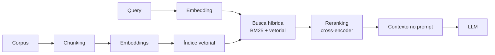

# RAG

> **Definição em uma frase:** técnica que recupera documentos relevantes e os coloca na janela de contexto, para que o modelo responda com base na fonte em vez de na memória paramétrica.

## Mecanismo

## Por que funciona

Porque separa **onde o conhecimento mora** de **como ele é usado**:

| | Conhecimento nos parâmetros | Conhecimento no contexto |
| --- | --- | --- |
| Atualizar | re-treinar | **trocar o índice** |
| Citar fonte | não | **sim** |
| Frescor | meses/anos | imediato |
| Verificar | impossível | possível |

## Decisões que importam mais que o modelo

1. **Chunking** — tamanho e sobreposição. Chunk grande demais: ruído e custo. Pequeno demais: perde contexto. Ver [[Chunking]].
2. **Busca** — híbrida (BM25 + vetorial) cobre os dois pontos cegos estruturais.
3. **Reranking** — embeddings são bons em *recall*, imprecisos no ranking fino. Cross-encoder reordena os 50–100 candidatos.
4. **Ordenação no prompt** — evidência relevante nas pontas, nunca no meio. Ver [[Lost in the Middle]].
5. **k (quantos chunks)** — cada um é token cobrado. Ver [[Janela de Contexto]].

## Quando RAG **não** é a resposta

| Necessidade | Melhor ferramenta |
| --- | --- |
| conhecimento factual atualizado | **RAG** |
| tom/formato/estrutura fixos | [[Fine-tuning]] |
| tarefa nova com muitas exemplos rotulados | [[Fine-tuning]] |
| capacidade nova (cálculo, acesso a rede) | **ferramentas** |
| conhecimento mutável e pessoal | memória externa / RAG |

Usar fine-tuning para ensinar fato é caro e desatualiza. Usar RAG para ensinar formato é desperdício de tokens.

## Autoavaliação
1. **P:** Por que RAG não altera os pesos? **R:** o mecanismo de atenção trata os tokens do contexto como parte da sequência, lendo-os na inferência. Nenhum gradiente é calculado.
2. **P:** RAG pode piorar a resposta? **R:** sim — contexto irrelevante e posição ruim podem piorar (lost in the middle). Retrieval é uma etapa com métrica própria, não um detalhe.

## Onde vi isso

- Visto em: [[O que é um LLM]], [[Embeddings e vetorização]]

## Ver também

- [[Embedding]] · [[Busca Semântica]] · [[Chunking]] · [[Fine-tuning]]

---
*Atualizado em 2026-09-30*

