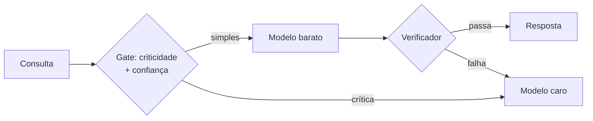

# Roteamento de modelos

> **Definição em uma frase:** decidir, consulta a consulta, qual modelo atende — barato por padrão, caro só quando a tarefa exige — para entregar qualidade onde importa sem pagar o teto de capacidade em tudo.

## Explicação curta

Em vez de escolher **um** modelo para o produto todo, o roteamento mantém dois ou mais e encaminha cada requisição conforme a criticidade e a confiança. É a resposta de engenharia ao dilema "modelo simples impreciso × modelo caro caro demais": as requisições simples vão para o barato; as ações críticas ou as que falham no verificador sobem para o forte. A estratégia também chamada de **híbrida**, e suas duas formas conhecidas:

- **Cascata** — o barato responde primeiro; um verificador (schema, checker, score) aprova ou rejeita; aprovou, acabou; rejeitou, escala. FrugalGPT: até **98% de economia** sem perder acurácia.
- **Roteamento aprendido** — um router binário (treinado com preferência humana) decide por consulta se manda para forte ou fraco: **>2× de economia** sem sacrificar qualidade (RouteLLM).

## Como funciona

Os três componentes que precisam existir: **gate** com critério escrito (criticidade de domínio + confiança + custo do erro em número), **verificador** barato (sem ele, cascata é sorte), e **medição** — o roteamento só se paga se a economia e a qualidade forem medidas no [[Benchmark]] do domínio.

## Exemplos

| Caso | Roteamento |
| --- | --- |
| SaaS de suporte: 90% FAQ, 1% cobrança | FAQ no barato; cobrança no caro + revisão humana |
| Extração de dados em volume | saída barata validada por schema; falhou, reprocessa no caro |
| Assistente de código | sugestão simples barata; alteração de arquivo crítica forte ou humano |

## Confusões e aparências

- ❌ **Não é** "usar dois modelos e deixar o usuário escolher" — roteamento é decisão automática, com critério, no caminho da requisição.
- ❌ **Não é** barato garantido — depende de verificador e de dados (o router aprendido exige preferências rotuladas).
- ✅ **É** uma decisão arquitetural: a camada de roteamento é a mesma que resolve parte do [[Vendor lock-in]] — e o plano de troca passa a ser trocar o modelo barato (ou o caro) sem tocar no produto.

## Autoavaliação
1. **P:** Cite os três componentes de um roteamento funcional. **R:** Gate com critério escrito, verificador barato no fim do caminho barato, e medição (economia e qualidade) em benchmark do domínio.
2. **P:** Por que a cascata sem verificador não funciona? **R:** Sem verificador, não há como saber que o barato errou — o gate de qualidade vira sorte.

## Onde vi isso

- Visto em: [[Estratégia híbrida de modelos]]
- Aprofundamento: [[Pesquisa - Custo e qualidade na seleção de modelos]] (FrugalGPT e RouteLLM)

## Ver também

- [[Modelo Frontier]] · [[Modelo Intermediário]] · [[Benchmark]] · [[Vendor lock-in]] · [[Escolha final e conclusão]]

---
*Atualizado em 2026-10-09*

