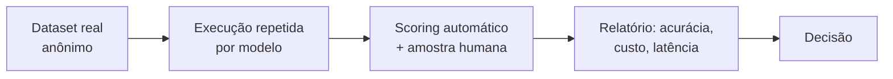

# Benchmarks: como medir o desempenho

> **Meta:** saber montar um benchmark que **decide** — comparação estatisticamente séria, funções reais do modelo, dados o mais próximos possível do uso real.

## Resumo em 3 frases

1. Medir desempenho de modelos é comparar sob condições controladas: **testes estatisticamente válidos**, das **funções reais** do modelo, com **dados o mais próximos possível do uso real**.
2. Benchmark público faz triagem; o que decide é o **benchmark do seu caso de uso** — porque teste irreal gera **falsos positivos**.
3. **Benchmark ruim leva a escolha ruim:** se a comparação não cobre as variações nem reflete o uso real, a escolha herdou o defeito do teste.

## As três fontes de medição

| Fonte | Para que serve | Limite |
| --- | --- | --- |
| **Leaderboard público** | triagem — descartar modelos fracos no que importa | mede média alheia; sofre contaminação e saturação (ver [[Pesquisa - Custo e qualidade na seleção de modelos]]) |
| **Benchmark do provedor** | entender o que ele se dispõe a comparar | comparação no cenário que favorece o próprio produto |
| **Benchmark do seu domínio** | **a decisão** | exige dados e esforço seus |

## O que torna um teste estatisticamente sério

- **Amostra suficiente** para a decisão que se vai tomar — 10 casos não separam 90% de 80%.
- **Repetição:** o mesmo caso roda mais de uma vez, porque a decodificação é estocástica (ver [[Temperatura e previsibilidade]]) — sem repetição, mede-se sorte.
- **Margem de erro explícita:** a comparação só vale se os intervalos não se sobrepõem.
- **Métrica ligada ao uso:** acurácia só se a tarefa for classificação; para geração, scoring de formato, fidelidade e taxa de falha de schema.

## Testar funções reais do modelo

O objeto do teste não é a micro-tarefa isolada — é a **função que o produto exige**: prompt completo (instrução + contexto + exemplos), saída no formato do produto, validação no fim. Um modelo que acerta "traduza esta frase" pode falhar no pipeline inteiro de resumo de contrato com saída estruturada. O benchmark ruim testa a tarefa fácil; o bom testa o trabalho.

## Gerar dados comparáveis para o seu caso

- **Mesmo dataset para todos os modelos** — nunca uma amostra diferente por modelo.
- **Casos reais** (anonimizados) do uso de produção — não frases escritas para o teste.
- **Cobrir as variações:** tamanhos de entrada, casos-limite, ruído (abreviação, erro de digitação), formatos de saída, variações de prompt.
- **Evitar falsos positivos:** dado contaminado (que apareceu no treino), caso escolhido depois de ver a resposta, avaliação só por modelo (sem revisão humana amostral).

## Pipeline mínimo

Cada modelo passa pelo **mesmo** pipeline, e o relatório junta os 3 critérios medidos: qualidade, custo por caso real e latência. É o benchmark virando a linha de decisão da [[Trade-offs na escolha do modelo]].

## Perguntas para validar

1. Por que benchmark público não decide — e o que decide? Qual é o papel de cada um?
2. Seu teste de 10 casos deu 90% (modelo A) e 80% (modelo B). Por que isso ainda não é comparação?
3. Dê um exemplo de falsos positivo num benchmark do seu domínio — e como evitá-lo.

## Ver também

- [[Benchmark]] · [[Estratégia híbrida de modelos]] · [[Pesquisa - Custo e qualidade na seleção de modelos]] · [[Latência]]

