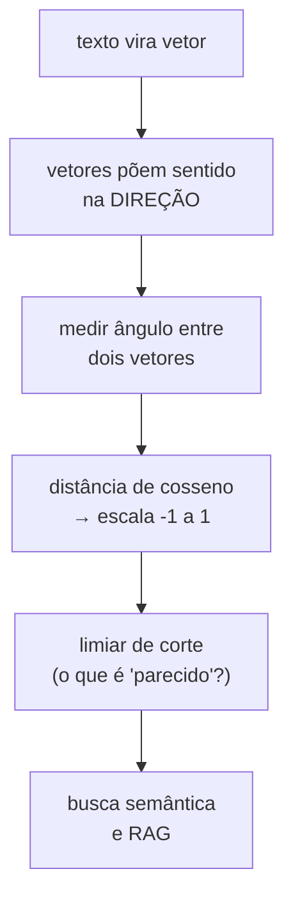

# Distância de Coseno e Significado

> **Meta:** explicar por que a *distância* entre dois vetores de embedding mede o
> *significado* — e por que o cosseno, e não a distância euclidiana, é o padrão.
> Escreva no fim: se passar de 40 palavras explicando por que cosseno,
> ainda está abstrato demais.

## Resumo em 3 frases

1. Embeddings põem o significado na **direção** do vetor, não no seu tamanho — por
   isso comparar vetores é comparar significado.
2. A **distância de cosseno** mede o ângulo entre dois vetores e ignora a magnitude,
   o que a torna invariante ao tamanho do documento.
3. O cosseno retorna valores entre **-1 e 1**; em embeddings de texto, textos com o
   mesmo tema ficam quase sempre acima de 0,7.

## O mapa

A[[Embeddings e vetorização]] mostrou *como* texto vira vetor. Esta aula mostra *o que fazer* com esses
vetores: medir o quanto dois textos significam a mesma coisa. É a ponte entre
"ter embeddings" e "buscar por similaridade" (o coração de qualquer RAG).

## Conceitos-chave

- [x] [[Similaridade de Cosseno]] — o ângulo entre dois vetores; padrão para embeddings.
- [x] [[Embedding]] — a representação vetorial do texto (visto na[[Embeddings e vetorização]].
- [x] [[Busca Semântica]] — recuperar pelo *significado*, não pela palavra-chave.
- [x] [[RAG]] — usa cosseno para achar trechos relevantes antes de responder.
- [x] [[Chunking]] — o cosseno só funciona bem se os pedaços forem coerentes.

## Distância de cosseno vs. as outras métricas

| Métrica | O que mede | Quando preferir |
| --- | --- | --- |
| **Cosseno** | ângulo, invariante à magnitude | **padrão** para embeddings de texto |
| **Produto escalar** | ângulo × magnitude | quando a magnitude carrega informação (ex.: frequência) — comum em índices de produção |
| **Euclidiana** | distância direta, fora de [0,1] | quando o modelo foi treinado com distância euclidiana |

⚠️ **Misturar métricas entre treino e inferência quebra o índice silenciosamente.**
Se o modelo foi treinado com produto escalar, usar cosseno na hora de buscar degrada
o ranqueamento sem lançar erro nenhum.

## Erros comuns

| Erro | Correção |
| --- | --- |
| "Distância de cosseno vai de 0 a 1" | Vai de **-1 a 1**. Embeddings de texto costumam ficar todos no positivo, mas o domínio completo é [-1, 1]. |
| "Quanto maior o cosseno, mais longe" | Ao contrário: **maior cosseno = mais parecido** (ângulo menor). |
| "Euclidiana e cosseno dão o mesmo ranqueamento" | Só se todos os vetores tiverem a mesma norma. Com normas diferentes, o ranqueamento muda. |
| "Embeddings mais longos têm cosseno menor" | Não — o cosseno **ignora o tamanho**. É exatamente por isso que ele é o padrão. |

## O limiar de corte é o pulo do gato

O cosseno te dá um número; a *decisão* é sua. Onde você corta para dizer "isto
contém"? Corta baixo (0,3) e o RAG puxa lixo; corta alto (0,9) e ele deixa de fora
trechos úteis. Esse limiar é empirico, por domínio, e é a parte do RAG que ninguém
ajusta — e que mais afeta a qualidade da resposta.

## Exercício

Rode o [[Lab 02 - Embeddings e similaridade]] e, antes de olhar o resultado, escreva
o que você espera para três pares: (mesmo texto), (texto parecido), (texto
relacionado mas de outro tema). Depois compare com o cosseno calculado. Se seu chute
e o número discordarem no terceiro caso, o limiar de corte é onde olhar.

## Onde isso conecta

- Anterior: [[Embeddings e vetorização]] — de onde vem o vetor.
- Próxima: [[Arquitetura Transformers e Attention]] — como o contexto é
  processado antes de virar embedding.
- Prática: [[Lab 02 - Embeddings e similaridade]]
- Pesquisa: [[Pesquisa - Embeddings e busca semântica]]

