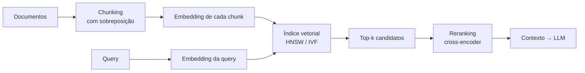

# Embeddings e vetorização

> **Meta:** explicar por que um vetor denso representa significado, por que o cosseno é a métrica padrão, e onde os embeddings quebram.

## Resumo em 3 frases

1. Um embedding é um vetor denso treinado para que a **distância geométrica** entre vetores corresponda à similaridade de significado — a hipótese distribicional (Harris 1954) formalizada.
2. Denso vence one-hot em generalização e custo; esparso (BM25) vence em correspondência literal. Buscas reais usam **os dois** — busca híbrida.
3. A similaridade não é um fato do texto: é uma escolha do modelo treinado. Trocar o modelo de embedding invalida o índice inteiro.

## One-hot vs. denso

| | One-hot | Embedding denso |
| --- | --- | --- |
| Dimensão | tamanho do vocabulário (~100k) | 384–4096 |
| Esparsidade | quase tudo zero | denso |
| "Feliz" ≈ "contente"? | sim (mesma posição) | não por acaso — **por treino** |
| "Cachorro" ≈ "cão"? | não | **sim**, se o treino achar isso |
| Custo de busca | alto | baixo |

O ponto do "não por acaso" é o essencial: a similaridade entre "feliz" e "contento" **não é dada** — ela é aprendida. O modelo de embedding é quem **decide** o que é parecido.

## word2vec e a hipótese distribucional

> *"Palavras que aparecem em contextos parecidos têm significados parecidos."* — Harris (1954); formalizado por Firth (1957).

- **Skip-gram** — da palavra central, prever as vizinhas. Bom para palavras raras (cada ocorrência gera vários exemplos).
- **CBOW** — das vizinhas, prever a palavra central. Mais rápido, enviesado contra termos raros.
- **Negative sampling** (Mikolov et al., 2013) — o truque que tornou viável: em vez de classificar a palavra certa entre 100 mil, o modelo só distingue "esse par apareceu" de "esse par foi sorteado". Classificador binário, converge rápido.

**GloVe** (Pennington et al., 2014) parte de uma matriz de coocorrência explícita e fatora.

Efeito colateral famoso: em um espaço bem treinado, aritmética vira semântica —

```
vetor("rei") - vetor("homem") + vetor("mulher") ≈ vetor("rainha")
```

Esse vetor é o que se chamava embedding "estático": um vetor por palavra, sem depender de contexto. "banana" é o mesmo vetor em qualquer frase. É uma limitação real, não um detalhe menor.

## De palavra para frase: SBERT

Média dos embeddings das palavras falha em frases porque **ordem e negação importam**: "não é bom" não é a média de "não" e "bom".

**Sentence-BERT (Reimers & Gurevych, 2019)** treina uma **rede siamesa**: duas instâncias do encoder com pesos compartilhados produzem um vetor fixo cada. A comparação passa a ser **um único cosseno**, em vez de rodar o modelo inteiro sobre cada par.

O resultado prático reportado no paper: achar o par mais similar em 10 mil sentenças cai de horas para segundos, mantendo a acurácia. É o que viabilizou busca semântica em escala de produção.

Treinamento: **contrastive** sobre triplas (âncora, positivo, negativo), com **hard negatives** — negativos já muito similares por busca lexical, que forçam o modelo a discriminar diferença de sentido real em vez de só "coisa parecida = coisa igual". É a diferença entre recuperação densa robusta e embedding decorativo.

## Métrica de similaridade

$$\text{cos}(a,b)=\frac{a\cdot b}{\|a\|\|b\|}$$

**Cosseno** é o padrão porque é **invariante à norma**: mede só o ângulo. Um documento longo e um curto com o mesmo conteúdo têm cosseno ≈ 1.

- **Produto escalar** mistura direção e magnitude. Alguns modelos usam magnitude de forma intencional (frequência) — por isso ele aparece em índices de produção.
- **Euclidiana** não fica entre 0 e 1, o que atrapalha limiares interpretáveis.

## Denso vs. esparso — e por que RAG usa os dois

| Caso | BM25 (esparso) | Embedding (denso) |
| --- | --- | --- |
| "contrato 8842-A" | ✅ match literal exato | ❌ ruído — dígitos são arbitrários |
| Nome próprio | ✅ se indexado | ⚠️ falha silenciosa |
| Paráfrase ("encerrar contrato" ↔ "termo de rescisão") | ❌ falha estrutural | ✅ por construção |

Daí a **busca híbrida**: combinar os dois e fundir os ranqueamentos (RRF). Não é ornamento, é a resposta ao fato de que cada método tem um ponto cego estrutural.

## Onde isso entra: RAG



- **Chunking** — cortar em pedaços de algumas centenas de tokens, com sobreposição para não partir ideia ao meio. Decisão de arquitetura, não detalhe.
- **Índice** — kNN exato (força bruta, ok para milhares), IVF (particiona por k-means), **HNSW** (grafo hierárquico, padrão atual).
- **Reranking** — embeddings são ótimos em *recall* e imprecisos no ranking fino. Um cross-encoder (que vê query e documento juntos) reordena os 50–100 candidatos. Etapa cheap que resolve a fraqueza cara.

## Avaliação

**MTEB** (Muennighoff et al., 2022): 8 tarefas, 58 datasets, 112 idiomas. A distinção que importa:

- **STS** — "esses dois textos significam a mesma coisa?"
- **Retrieval** — "qual chunk responde a esta pergunta?"

Um modelo pode ser excelente em um e ruim no outro. **Avalie na sua tarefa, não na média do leaderboard.** Agregar dilui exatamente o contraste que decide entre embedding e busca híbrida.

## Limitações (para citar em trabalho)

1. **Viés herdado** — estereótipos dos corpora aparecem no espaço vetorial e vazam para o resultado da busca.
2. **Ordem se perde** — o chunk é tratado como conjunto; negação e estrutura sintática se diluem.
3. **Similaridade é escolha, não fato** — trocar de modelo de embedding exige **reindexar tudo**; embeddings de modelos diferentes não convivem no mesmo índice.
4. **Domínio** — embedding genérico degrada em jargão técnico sem retreino.

## Perguntas para validar

1. Se eu fizer PCA nas embeddings para "acelerar a busca", por que a recuperação pode piorar?
2. Em um sistema que precisa responder "qual o número do contrato 8842-A?", embedding resolve? BM25 resolve?
3. Por que trocar o modelo de embedding exige reindexação, e não basta recalcular as queries?
4. O que um hard negative faz que um negativo aleatório não faz?

## Referências

- Mikolov et al., *Efficient Estimation of Word Representations in Vector Space* — https://arxiv.org/abs/1301.3781
- Mikolov et al., *Distributed Representations of Words and Phrases* (negative sampling) — https://arxiv.org/abs/1310.4546
- Pennington, Socher & Manning, *GloVe* — https://aclanthology.org/D14-1162/
- Reimers & Gurevych, *Sentence-BERT* — https://arxiv.org/abs/1908.10084
- Karpukhin et al., *Dense Passage Retrieval (DPR)* — https://arxiv.org/abs/2004.04906
- Muennighoff et al., *MTEB* — https://arxiv.org/abs/2210.07316
- Malkov & Yashunin, *HNSW* — https://arxiv.org/abs/1603.09320

## Ver também

- [[Pesquisa - Embeddings e busca semântica]] · [[Lab 02 - Embeddings e similaridade]] · [[RAG]]

<script>
// Correcao do Mermaid no Quartz 5.0.0.
(() => {
  const CDN =
    "https://cdnjs.cloudflare.com/ajax/libs/mermaid/11.4.0/mermaid.esm.min.mjs";
  let proximo = 0;
  let tentativas = 0;

  const vazios = () =>
    [...document.querySelectorAll("code.mermaid")].filter((n) => {
      const svg = n.querySelector("svg");
      return svg && svg.querySelectorAll("path,rect,polygon,circle").length === 0;
    });

  const fonte = (n) =>
    (n.getAttribute("data-clipboard") || "")
      .replace(/^"|"$/g, "")
      .replace(/\\"/g, '"')
      .replace(/\\n/g, "\n")
      .replace(/&lt;/g, "<")
      .replace(/&gt;/g, ">")
      .replace(/\\\\/g, "\\");

  // As cores do tema vao em CSS vars; o plugin do Mermaid usa exatamente
  // estas. O padrao cobre o caso de a cor nao estar no quartz.config.yaml —
  // `--highlight: undefined` e o que derrubava o render original.
  const cor = (nome, padrao) => {
    const v = getComputedStyle(document.documentElement)
      .getPropertyValue(nome)
      .trim();
    return v && v !== "undefined" ? v : padrao;
  };

  const configuracao = () => {
    const escuro =
      document.documentElement.getAttribute("saved-theme") === "dark";
    return {
      startOnLoad: false,
      securityLevel: "loose",
      theme: escuro ? "dark" : "base",
      themeVariables: {
        fontFamily: cor("--codeFont", "monospace"),
        primaryColor: cor("--light", escuro ? "#1b1b19" : "#fdfdfc"),
        primaryTextColor: cor("--darkgray", escuro ? "#b0aca3" : "#4c4a45"),
        primaryBorderColor: cor("--tertiary", escuro ? "#c8b073" : "#8a7a4f"),
        lineColor: cor("--gray", escuro ? "#6e6b64" : "#b4b0a8"),
        secondaryColor: cor("--secondary", escuro ? "#7fc4a5" : "#1f5f4e"),
        tertiaryColor: cor("--tertiary", escuro ? "#c8b073" : "#8a7a4f"),
        clusterBkg: cor("--light", escuro ? "#1b1b19" : "#fdfdfc"),
        edgeLabelBackground: cor("--highlight", escuro ? "#3a3a36" : "#e8e6e1"),
      },
    };
  };

  const corrigir = (alvo) => {
    import(CDN)
      .then((m) => {
        m.default.initialize(configuracao());
        return Promise.all(
          alvo.map(async (n) => {
            try {
              const { svg } = await m.default.render(
                "corrige-" + proximo++,
                fonte(n),
              );
              n.innerHTML = svg;
            } catch (e) {
              console.warn("mermaid: falhou um diagrama", fonte(n).slice(0, 40), e);
            }
          })
        );
      })
      .then(ajustar)
      .catch((e) => console.warn("mermaid: CDN indisponivel", e));
  };

  // --------------------------------------------------------- contraste
  const rgb = (v) => {
    const m = (v || "").match(/[\d.]+/g);
    if (!m || m.length < 3) return null;
    const a = m.length > 3 ? Number(m[3]) : 1;
    return a === 0 ? null : [Number(m[0]), Number(m[1]), Number(m[2])];
  };

  const luminancia = (c) => {
    const f = (x) => {
      x /= 255;
      return x <= 0.03928 ? x / 12.92 : Math.pow((x + 0.055) / 1.055, 2.4);
    };
    return 0.2126 * f(c[0]) + 0.7152 * f(c[1]) + 0.0722 * f(c[2]);
  };

  const contraste = (a, b) => {
    const la = luminancia(a);
    const lb = luminancia(b);
    return (Math.max(la, lb) + 0.05) / (Math.min(la, lb) + 0.05);
  };

  // O Mermaid monta as cores das secoes do mindmap a partir de
  // --secondary/--tertiary escurecidas 25% — em tema claro vira fundo preto
  // (ou marrom escuro) com texto escuro por cima: 1.4:1 de contraste. O texto
  // ja vem na cor certa do tema; entao o fundo do no e que cede: clareia
  // (tema claro) ou escurece (tema escuro) ate bater 4.5:1.
  const ajustar = () => {
    const alvo =
      document.documentElement.getAttribute("saved-theme") === "dark"
        ? [0, 0, 0]
        : [255, 255, 255];
    document
      .querySelectorAll("code.mermaid svg .mindmap-node")
      .forEach((g) => {
        const texto = g.querySelector("text");
        // a caixa visivel e path.node-bkg; rect.background existe tambem mas
        // vem com 0x0 (serve so de ancora do rotulo) — tem que achar a forma
        // com area de verdade, senao o ajuste cai no elemento errado.
        const formas = [
          ...g.querySelectorAll(
            "path.node-bkg, path.node-circle, rect.background, ellipse, circle, polygon",
          ),
        ];
        let forma = null;
        let melhor = -1;
        for (const f of formas) {
          const b = f.getBoundingClientRect();
          const area = b.width * b.height;
          if (area > melhor) {
            melhor = area;
            forma = f;
          }
        }
        if (!texto || !forma || melhor <= 0) return;
        const t = rgb(getComputedStyle(texto).fill);
        let f = rgb(getComputedStyle(forma).fill);
        if (!t || !f || contraste(t, f) >= 4.5) return;
        for (let i = 0; i < 12 && contraste(t, f) < 4.5; i++) {
          f = f.map((v, k) => v + (alvo[k] - v) * 0.4);
        }
        f = f.map((v) => Math.round(v));
        forma.style.fill = "rgb(" + f.join(", ") + ")";
        // o sublinhado do no vinha na cor de contraste do fundo antigo
        const linha = g.querySelector("line");
        if (linha) {
          const l = rgb(getComputedStyle(linha).stroke);
          if (!l || contraste(l, f) < 3) {
            linha.style.stroke = "rgb(" + t.join(", ") + ")";
          }
        }
      });
  };

  // Tenta varias vezes: o SVG do Quartz pode aparecer depois do DOMContentLoaded.
  // O reset fica em observar(), senao a recursao re zerava a contagem.
  const agendar = (atraso) => {
    setTimeout(() => {
      ajustar();
      const alvo = vazios();
      if (alvo.length > 0) {
        tentativas = 0;
        return corrigir(alvo);
      }
      if (tentativas++ < 40) agendar(500);
    }, atraso);
  };

  const observar = (atraso) => {
    tentativas = 0;
    agendar(atraso);
  };

  if (document.readyState === "complete") observar(1500);
  else window.addEventListener("load", () => observar(1500));

  // No troque de tema o Quartz re-renderiza os diagramas com as cores novas;
  // se o render dele falhar de novo, aqui entra. O atraso deixa o do Quartz
  // terminar antes, para nao ser sobrescrito em seguida.
  document.addEventListener("themechange", () => observar(2000));
})();
</script>
