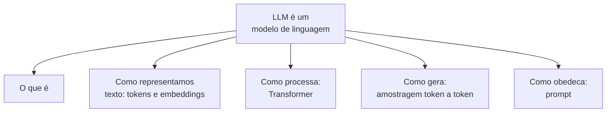

# Modelos de Linguagem: como funcionam

> **Meta:** descrever o pipeline completo de um LLM em uma frase, do texto à resposta, sem consultar nada.
> Escreva a versão final no fim e meça: se passar de 40 palavras, ainda está abstrato demais.

## Resumo em 3 frases

1. Um LLM é uma função que recebe uma sequência de tokens e devolve uma **distribuição de probabilidade sobre o próximo token**; repetir isso passo a passo é o que "escreve" a resposta.
2. Todo o trabalho pesado está em uma única peça — o **Transformer** — que processa todos os tokens do contexto **em paralelo** e produz um vetor por token que carrega o significado no contexto atual.
3. Nada disso é conhecimento: o modelo aprendeu **estatística de texto**. Por isso ele acerta tanto e por isso ele inventa com a mesma fluência.

## O mapa

Esta aula é o índice do módulo. Ela não pede que você saiba nada ainda — pede que você saiba o que *vai* saber.

## Conceitos-chave

- [x] [[Token]] — unidade de texto que o modelo realmente enxerga
- [x] [[Embedding]] — representação vetorial de um token no espaço
- [x] [[Transformer]] — arquitetura que processa o contexto em paralelo
- [x] [[Logits]] — pontuação de cada token possível para a próxima posição
- [x] [[Janela de Contexto]] — tudo que cabe numa chamada

## Por que "linguagem" e não "compreensão"

O modelo é treinado para responder à pergunta: **qual token vem a seguir?**. Essa tarefa, sozinha, é suficiente para produzir sistemas que parecem entender texto. É a mesma lógica de como uma criança aprende a falar: ninguém chega explicando gramática antes da primeira frase.

A consequência é profunda e vale internalizar: **o modelo não tem uma noção interna de "verdade"**. Ele otimiza plausibilidade estatística. Daí decorrem alucinação, deferência indevida de instrução, e o sucesso de contextos muito longos (veja [[Lost in the Middle]]).

## O que eu não devo acreditar

Mitos que aparecem desde o primeiro dia e custam caro depois:

| Mito | Realidade |
| --- | --- |
| "O modelo guarda o que eu falei" | Só se estiver dentro da [[Janela de Contexto]] desta chamada. Nada persiste. |
| "Ele tem acesso à internet / à data de hoje" | Não. Só tem o que está no contexto + o que foi visto no pré-treino. |
| "Ele tem memória entre conversas" | Não, sem um mecanismo explícito de memória externa. |
| "Se pedir duas vezes, dá a mesma resposta" | Quase nunca. Ver [[Temperatura]]. |
| "É uma base de dados que consulta" | Não. Não há consulta; há distribuição de probabilidade. |
| "Entender = compreender" | Não. Compreender a saída de um LLM não implica compreender o processo interno. |

## A intuição do pipeline

Quando você pede "explique o que é KV cache", acontece isto:

1. **Tokenização** — seu texto vira tokens. (~)
2. **Embeddings** — cada token vira um vetor; "cache" vira um vetor diferente de " Cachê". (~)
3. **Transformer** — cada token olha para todos os outros e ajusta seu próprio vetor conforme o contexto. É aqui que "cache" ganha o sentido de "guardar". (~)
4. **Logits** — o modelo sai um score para cada token do vocabulário. (ex:) não é o mais alto)
5. **Amostragem** — você sorteia. (Maior pontuação, mas não obrigatoriamente.)("")
6. **Loop** — repete até o modelo sinalizar fim.

Dois fatos que valem mais que todo o resto desta lista:

- **Os passos 2–4 são paralelos**; só o passo 5–6 é sequencial. Essa assimetria explica a latência (ver [[Prefill]] vs decode).
- **Nada na etapa 4 consulta "a resposta certa"**. Existe uma distribuição, e você escolhe um ponto dela.

## Perguntas para validar

Responda agora, sem olhar, e confira depois:

1. Em uma frase, o que um LLM faz?
2. Quais das etapas do pipeline são paralelas e qual é sequencial?
3. Por que "ele não tem acesso à internet" é uma consequência do treino, e não uma configuração?
4. Se um modelo é determinístico no papel, por que a mesma pergunta gera respostas diferentes? *(resposta na [[Temperatura e previsibilidade]])*

## Referências de entrada (depois: [[O que é um LLM]])

- Karpathy, A. — *Let's build GPT: from scratch, in code, spelled out* (YouTube). Base mais clara para o resto do módulo.
- Karpathy, A. — *The spelled-out intro to transformers* (YouTube). É praticamente a[[Arquitetura Transformers e Attention]] animada.
- Alammar, J. — *The Illustrated Transformer* — https://jalammar.github.io/illustrated-transformer/
- Jurafsky & Martin — *Speech and Language Processing*, cap. 3 (rascunho gratuito) — https://web.stanford.edu/~jurafsky/slp3/

## Checklist de conclusão

- [ ] Escrevi a frase-resumo do topo sem consultar
- [ ] Sei explicar por que a etapa de amostragem torna o sistema estocástico
- [ ] Consigo citar 3 mitos e responder por que são falsos

