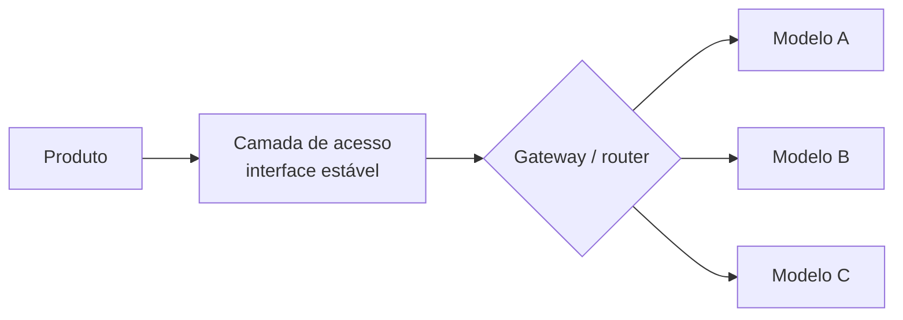

# Vendor lock-in: como evitar?

> **Meta:** tratar o vendor lock-in como decisão arquitetural do início do projeto — e conhecer as alavancas concretas que mantêm a troca de modelo sempre possível.

## Resumo em 3 frases

1. **Vendor lock-in em IA** é a dependência de um fornecedor cujo custo de troca ficou proibitivo — e ela nasce de escolhas arquiteturais tomadas **no início do projeto**, não do preço da API.
2. A mitigação é **projetar processos que trocam de modelo**: interface estável de acesso, prompts e dados em formatos portáveis, e evals que validam o substituto antes da troca.
3. Manter a opção de trocar é barato no início e caríssimo depois — por isso lock-in é **decisão de arquitetura de software**, com padrões de projeto conhecidos.

## De onde vem o lock-in

| Forma de lock-in | O que prende |
| --- | --- |
| API proprietária | endpoint, SDK, autenticação e limites próprios de cada provedor |
| Formato de prompt | instruções calibradas para o comportamento de um modelo específico |
| Embeddings presos | vetor gerado por um modelo não serve para busca de outro (ver [[Embedding]]) |
| Fine-tuning preso | pesos ajustados num provedor não migram para outro |
| Ferramentas e saída estruturada | recursos (tools, structured output) com semântica própria |

## Por que decidir no início

O custo de troca **cresce com o tempo**: dados acumulados no formato do provedor, prompts reescritos em volta do comportamento de um modelo, produto inteiro montado em torno de respostas de um único modelo. Cada mês de uso aumenta o trabalho da troca; a arquitetura que permite trocar, uma vez feita, custa quase nada.

## Alavancas de mitigação

| Alavanca | O que faz |
| --- | --- |
| **Interface única (adaptador)** | o produto fala com uma interface; quem conhece os provedores é a camada de acesso — padrão **Adapter/Port** |
| **Camada anticorrupção** | traduz semântica do provedor para o seu modelo de domínio — padrão **Anti-corruption layer** |
| **Prompts genéricos e versionados** | instrução escrita para a *tarefa*, não para os modismos de um modelo; versionamento permite comparar versões |
| **Dados portáveis** | histórico, cache e vetores exportáveis; evitar que a base de conhecimento só exista dentro do provedor |
| **Evals de troca** | uma suite de testes que o substituto precisa passar — é o que transforma "trocar é possível" em "trocar é comprovado" |
| **Multi-provider opcional** | gateway que fala com mais de um provedor, mantendo o segundo caminho vivo por pequeno tráfego |

## Armadilhas

- ❌ **Abstração que finge igualdade:** os modelos **não** se comportam igual — a camada de acesso esconde o acoplamento, não a diferença. Por isso a alavanca nº 5 (evals de troca) é obrigatória junto com a nº 1.
- ❌ **Fine-tuning não é portável:** peso ajustado fica no provedor; se depender dele, o lock-in é total.
- ❌ **Over-engineering:** nem todo projeto precisa de dois provedores vivos; a interface única já compra a maior parte da liberdade.

## Perguntas para validar

1. Por que vendor lock-in é decisão de **arquitetura** e não de compra — e por que ela precisa ser tomada no início do projeto?
2. Cite quatro alavancas de mitigação e explique por que a abstração sozinha não basta.
3. Se o seu produto usasse só um modelo hoje, o que teria que existir para trocar amanhã sem reescrever o produto?

## Ver também

- [[Vendor lock-in]] · [[Roteamento de modelos]] · [[Benchmark]] · [[Benchmarks: como medir o desempenho]] · [[Modelo Open-Weight]]

