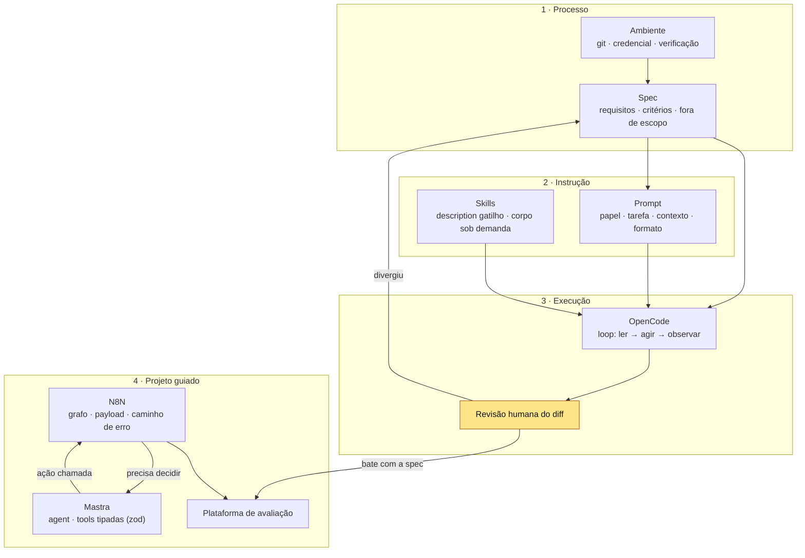

# Mapa — Da especificação ao agente

> **Síntese do módulo.** Este mapa é o entregável final: se você conseguir
> redesenhar de memória e explicar cada aresta, o módulo está consolidado.

## O pipeline completo

## Onde cada conceito entra

| Conceito | Papel no pipeline | Falha típica se ele faltar |
| --- | --- | --- |
| [[Ambiente de Desenvolvimento com IA]] | base: retorno e verificação | sem saber de onde veio o vermelho |
| [[Spec-Driven Development]] | direção antes da geração | agente supõe, humano conserta depois |
| [[Prompt Engineering - fundamentos]] | contrato da instrução pontual | resposta genérica, formato errado |
| [[Agent Skills]] | conhecimento reutilizável sob demanda | preferências repetidas toda sessão |
| [[OpenCode]] | executor do loop no terminal | — (é a ferramenta, não o método) |
| [[Desenvolvimento de Software com IA]] | o ciclo completo, humano no portão | *vibe coding* incansável |
| [[N8N]] | orquestração determinística do projeto | lógica de negócio escondida em código |
| [[Mastra]] | cérebro do agente: decisões e tools | alucinação de argumento, efeito sem contrato |

## Para redesenhar de memória

1. Desenhe o fluxo **Processo → Instrução → Execução** com as arestas de
 retroalimentação (o que volta para a spec quando a revisão diverge).
2. Onde entra o **custo de contexto** nesse desenho? (dica: níveis 1–3 das
 skills, histórico do agente)
3. Ligue **N8N ↔ Mastra** explicando o contrato de cada lado (chamada e retorno).
4. Marque os **3 pontos de verificação humana** do pipeline inteiro.
5. Sem olhar: qual falha cada conceito previne? (tabela acima é o gabarito)

## Ver também

- [[Desenvolvimento de Software com IA]] · [[Spec-Driven Development]]
- [[N8N]] · [[Mastra]] · [[Agent Skills]]

