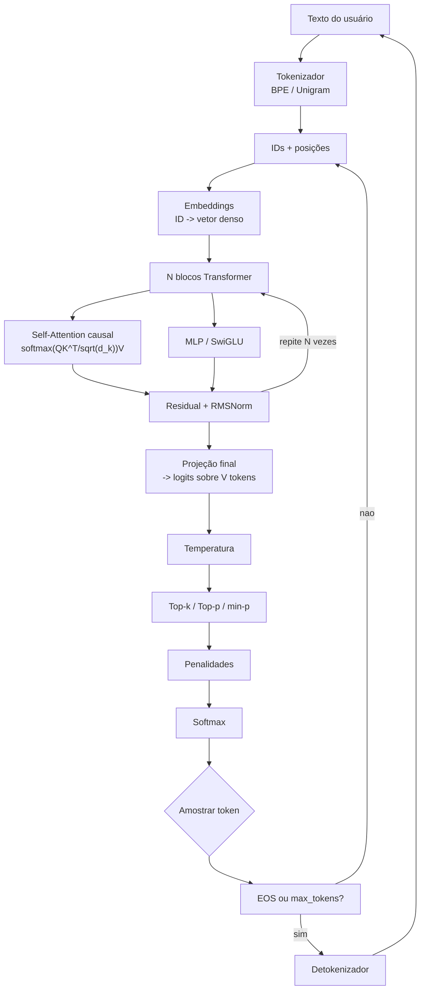
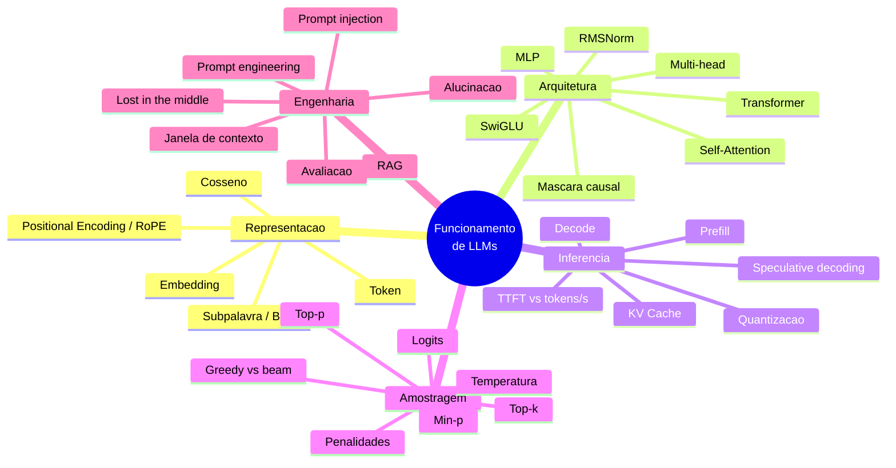
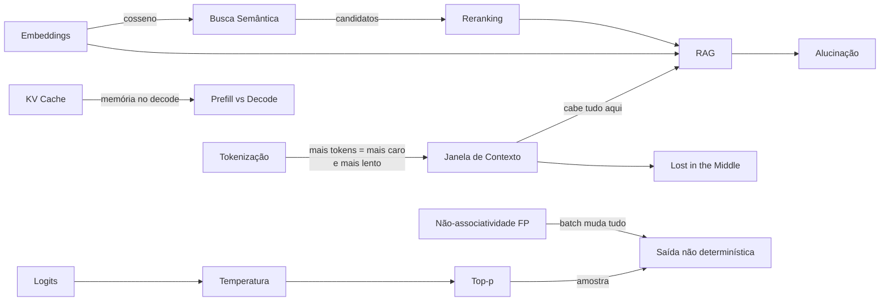
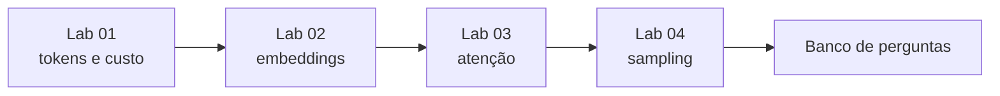

# Mapa — Funcionamento de LLMs

## O pipeline completo

## Áreas temáticas

## Relações que valem memorizar

## As perguntas que este site tenta responder

| # | Pergunta | Onde está |
| --- | --- | --- |
| 1 | Como o texto vira tokens, e por isso custa dinheiro? |[[Token]] |
| 2 | Como o significado vira geometria? |[[Embedding]] |
| 3 | Como cada token "lê" o contexto inteiro? |[[Transformer]] |
| 4 | Por que a mesma pergunta dá respostas diferentes? |[[Temperatura]] |
| 5 | Como um token vira o próximo token? |[[Self-Attention]] |
| 6 | Por que a ordem no prompt importa? |[[Janela de Contexto]] |

## Conceitos-chave (20 neste mapa)

**Representação** — [[Token]] · [[Embedding]] · [[Similaridade de Cosseno]] · [[Positional Encoding]]
**Arquitetura** — [[Transformer]] · [[Self-Attention]]
**Inferência** — [[KV Cache]] · [[Prefill]] · [[Janela de Contexto]]
**Decodificação** — [[Logits]] · [[Temperatura]] · [[Top-p Sampling]] · [[Top-k Sampling]] · [[Perplexidade]]
**Engenharia** — [[Alucinação]] · [[RAG]] · [[Busca Semântica]] · [[Modelo Base]] · [[Lost in the Middle]] · [[Prompt Injection]]

## Labs disponíveis

